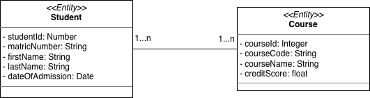
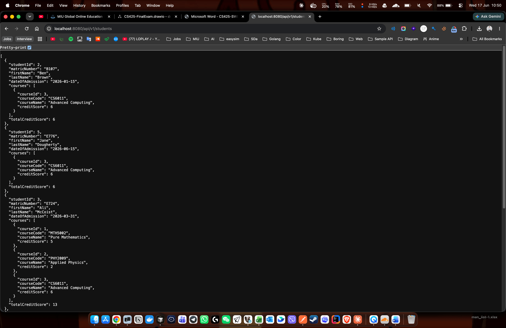
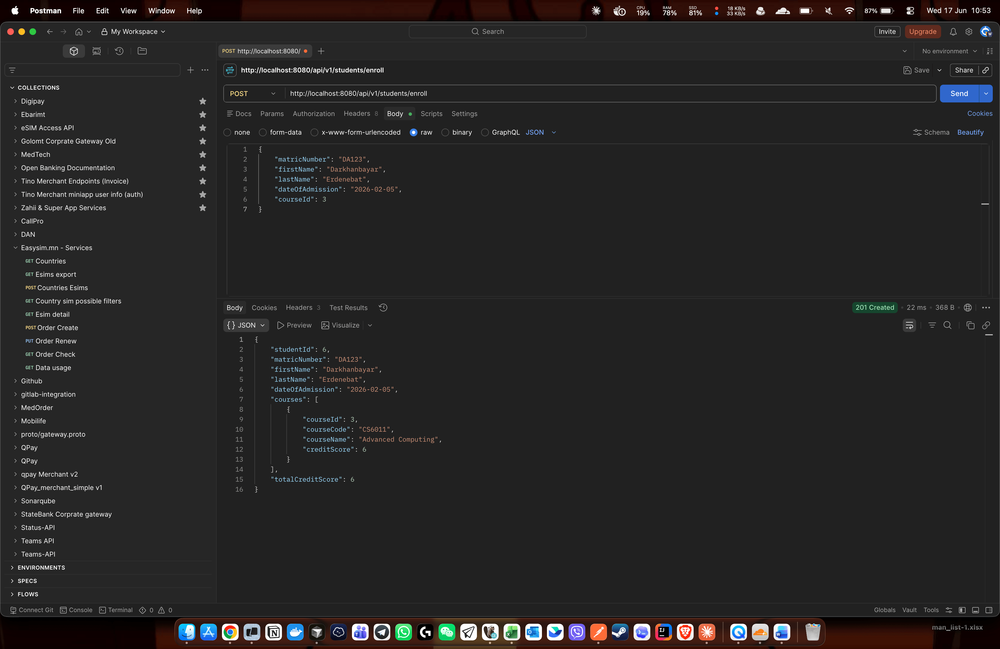
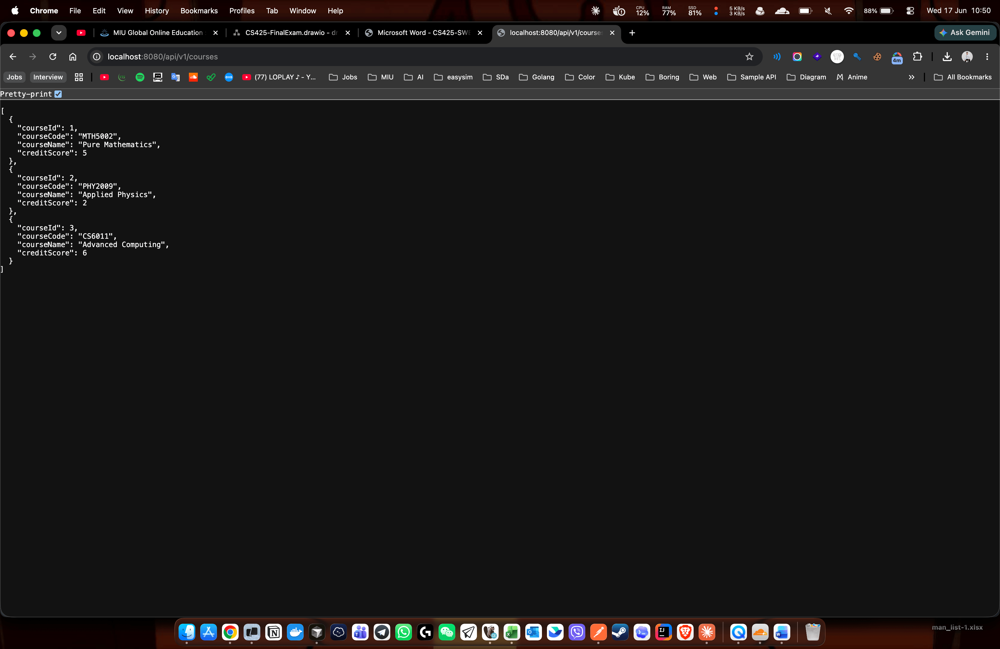
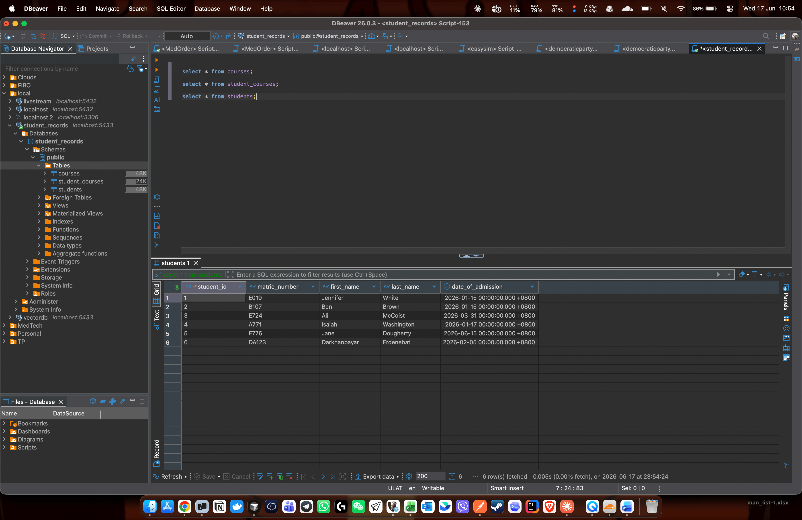
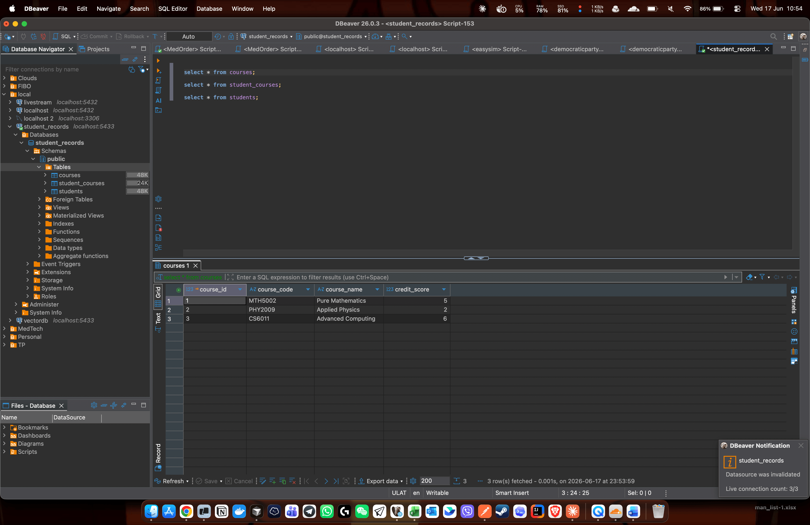
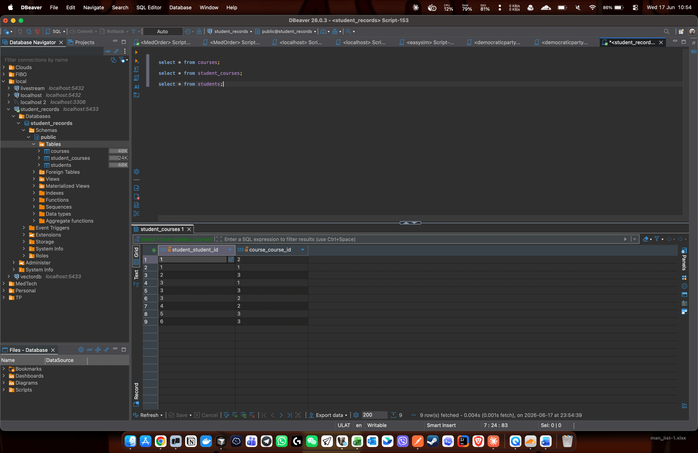

# Prince University – Student Records RESTful API

**Name:** Darkhanbayar Erdenebat
**Student ID:** 620283
**Repository:** https://github.com/Darkhaamn/cs425-final-exam

## Stack
- **Go** + **Gin** (web framework)
- **GORM** ORM + **PostgreSQL** (`gorm.io/driver/postgres`)
- **Docker Compose** for the PostgreSQL database (and the API)

## Architecture (layered)
```
controller/  HTTP handlers (Gin)        -> request/response only
service/     business logic             -> total credit score, honor-roll rule, enroll
repository/  data access (GORM)         -> queries against PostgreSQL
model/       domain entities + view DTO
database/    connection, migration, seeding
main.go      wires database -> repository -> service -> controller
```

## Domain model
A `Student` can be registered to many `Course`s, and each `Course` can have
many `Student`s — a many-to-many relationship (join table `student_courses`).



## Run

### Option A — Postgres in Docker, API on host
```bash
docker compose up -d db          # starts PostgreSQL (host port 5433 -> container 5432)
go run .                         # reads .env; API on http://localhost:8080
```

### Option B — everything in Docker
```bash
docker compose up --build        # db + api together; API on http://localhost:8080
```

DB connection is configured via env vars (defaults in parentheses):
`DB_HOST` (localhost), `DB_PORT` (5432), `DB_USER` (prince),
`DB_PASSWORD` (prince), `DB_NAME` (student_records), `PORT` (8080).

The schema is auto-migrated and the University's existing data is seeded on
first run. Base path for all endpoints is `/api/v1`.

## Endpoints

### 1. List all students — `GET /api/v1/students`
All students with their course(s) and the **computed total credit score**,
sorted **ascending by last name**.
```bash
curl http://localhost:8080/api/v1/students
```

### 2. Honor Roll — `GET /api/v1/students/honorRoll`
Students registered for at least one course with `creditScore >= 5`.
```bash
curl http://localhost:8080/api/v1/students/honorRoll
```

### 3. Enroll a new student — `POST /api/v1/students/enroll`
Registers a new student into a course by `courseId`.
```bash
curl -X POST http://localhost:8080/api/v1/students/enroll \
  -H "Content-Type: application/json" \
  -d '{
        "matricNumber": "E776",
        "firstName": "Jane",
        "lastName": "Dougherty",
        "dateOfAdmission": "2026-06-15",
        "courseId": 3
      }'
```

### 4. List all courses — `GET /api/v1/courses`
```bash
curl http://localhost:8080/api/v1/courses
```

## Inspect the database
```bash
docker exec -it prince_pg psql -U prince -d student_records \
  -c "SELECT * FROM students ORDER BY student_id;" \
  -c "SELECT * FROM courses ORDER BY course_id;" \
  -c "SELECT * FROM student_courses;"
```

## Screenshots

### API responses

**List all students** — `GET /api/v1/students`


**Honor Roll** — `GET /api/v1/students/honorRoll`


**Enroll new student** — `POST /api/v1/students/enroll`


**List all courses** — `GET /api/v1/courses`


### Database tables

**students**


**courses**


**student_courses (join table)**

